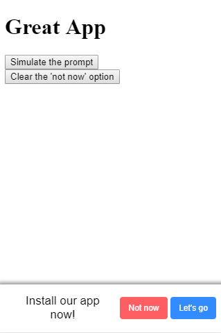

# A2H-nice-ask
A more friendly way to ask the user to install your PWA using beforeinstallprompt.

## Why?
The default a2h prompt changes between browsers and devices, leaving you no option of styling. This repository wants to give you an option.
With A2H-nice-ask you can change the way you ask your users to install your app, and also delay the prompt for some time (the default is 12 hours) so the user don't get annoyed. This was inspired by the [google developers guide for app-install-banners](https://developers.google.com/web/fundamentals/app-install-banners/?hl=en) written by Pete LePage.

## Lockr?
Lockr is "a minimal API wrapper for localStorage". I made a fork from the original repository to add the expires option. You can [check my fork here](https://github.com/lucaasleaal/lockr).

## How to use
Include the needed files (js and css) and call a2hAskNicelly() before the body tag end.

## Screenshot

